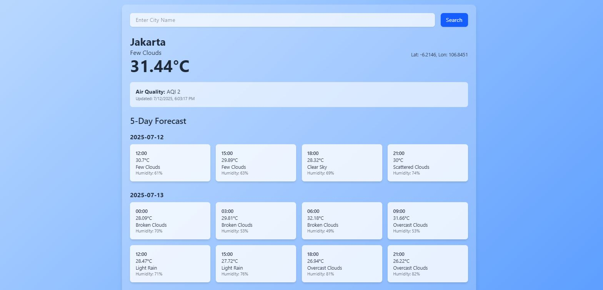

# Weather App

This is a simple weather website built using **Node.js**, **Express**, **EJS**, and **Tailwind CSS**. It utilizes **OpenWeather API** to fetch and display:

- Current weather conditions
- Air quality index (AQI)
- 5-day forecast (grouped by day, shown in 3-hour intervals)

---

## Preview

 <!-- ganti dengan screenshot nanti -->

---

## Live Demo

Coming soon...

---

## Features

- Fetch weather based on city name
- Display AQI with timestamp
- Show grouped daily forecast with hourly details
- Styled using Tailwind CSS

---

## Tech Stack

- **Backend:** Node.js, Express, Axios
- **Templating:** EJS
- **Styling:** Tailwind CSS
- **API:** [OpenWeather](https://openweathermap.org/api)

---

## Installation

1. Clone the repository
    git clone https://github.com/rildaril/Weather-App-with-OpenWeather-API.git

2. Navigate to the project directory
    cd "Weather App"

3. Install dependencies
    npm install

4. Start the server
    node index.js

5. Open the browser
    http://localhost:3000

## Notes

* This project uses the Free Plan from OpenWeather, which limits to 60 API calls/minute.
* You’ll need an API key from OpenWeather.